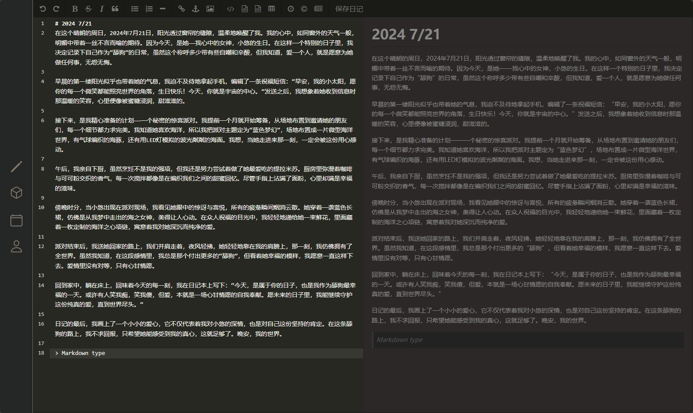

<center>
<h1>📓Diary</h1>
</img>
</center>
一款开源的日记 APP，前后端分离，使用性能强的Rust构建。WebUI构建借鉴开源项目 [侠客日记](https://github.com/Yu-Core/SwashbucklerDiary)

## 环境
- 💻 **前端：**
    - Tailwind CSS
    - Alpine.js
    - editormd
- 🖥️ **后端：**
    - Actix_web

开发环境为 `WSL Ubuntu 24.04`，其余开源 Rust库详见目录文件 `Cargo.toml`

## 构建
```bash
cargo run
```